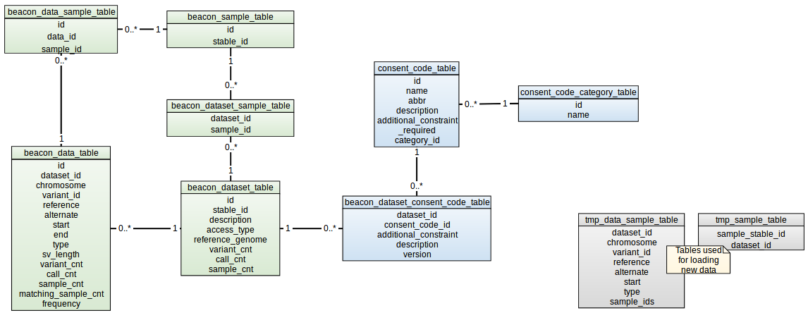

# Table of contents    

* [Requirements](#requirements)  
* [Configure databases](#configure-databases)  
  * [Create databases](#create-databases)  
  * [Load the data](#load-the-data)  
* [Managing the code](#managing-the-code)  
  * [Download the project](#download-the-project)  
  * [Elixir Core](#elixir-core)  
  * [Elixir Beacon, the main project](#elixir-beacon-the-main-project)  
    * [Configuration files](#configuration-files)  
  * [Compile and test the code](#compile-and-test-the-code)  
  * [Deploy the JAR](#deploy-the-jar)  
  * [Run integration tests](#run-integration-tests)  
* [Using the application](#using-the-application)  
  * [/beacon/](#beacon)  
  * [/beacon/query](#beaconquery)  
* [Further information](#further-information)  
  * [Project structure](#project-structure)  
  * [Extend/Change functionality](#extendchange-functionality)  
  
 # Requirements  

* Java 8 JDK  
* Apache Maven 3  
* PostgreSQL Server 9.6+, or any other SQL server (i. e. MySQL)  
* JMeter  
  
# Configure databases  
## Create databases  
1. Connect to the server:  
    ```  
    psql -h localhost -p 5432 -U postgres  
    ```  
    Notice that: 
    * If you want to use a different database **name**, **user** or your Postgres server is running in a different **host** or is listening to a different **port**, please, replace the values in the previous command.    
    * You will need a user with enough permissions to create databases. 
    
    These are the most common options used with the `psql` command:  
    * `-d`: database name (depending on the command the database name will be specified with this option).  
    * `-h`: hostname or IP of the machine where the Postgres server is running.  
    * `-p`: port that the Postgres server is listening to.  
    * `-U`: user name that will be used to connect to the database.  
2. Create two databases. Default names are:  
    * `elixir_beacon_dev`: this is the main database which will be used by the application.  
    * `elixir_beacon_testing`: this is a secondary database which will be used to run the tests.  
    ```sql  
    CREATE DATABASE elixir_beacon_dev;  
    CREATE DATABASE elixir_beacon_testing;  
    ```  
3. Create a user that will be used by the application to connect to the databases we just created:  
    ```  
    createuser -P microaccounts_dev  
    ```  
    This command will prompt for the password of the new user. Remember this password as we will need it to configure the application.  
   
4. Log in each of the databases and grant privileges to the user just created:  
    ```  
    psql elixir_beacon_dev -U postgres  
    ```  
    ```sql  
    GRANT ALL PRIVILEGES ON DATABASE elixir_beacon_dev TO microaccounts_dev;  
    GRANT ALL PRIVILEGES ON DATABASE elixir_beacon_testing TO microaccounts_dev;  
    ```  
    NOTE: You can skip this step and load the schema using a super user in the next step and, after that, grant privileges to a different user (this user will be used by the application to connect to the database).  
  
5. Download the schema ([elixir_beacon_db_schema.sql](deploy/db/db/db_schema.sql)) and load it in **both** databases:   
    ```  
    psql -h localhost -p 5432 -d elixir_beacon_dev -U microaccounts_dev < elixir_beacon_db_schema.sql  
    psql -h localhost -p 5432 -d elixir_beacon_testing -U microaccounts_dev < elixir_beacon_db_schema.sql  
    ```  
    That script will create the tables and views and also load some essential data for data use conditions.  
    
        Here you can find a diagram of this schema:
       
    If you use a super user to create the schema, then you will need to grant access to the ordinary user that will be used by the application (e.g. microaccounts_dev):  
    ```  
    psql -h localhost -p 5432 -d elixir_beacon_dev -U postgres  
    ```  
    ```sql  
    GRANT ALL PRIVILEGES ON ALL SEQUENCES IN SCHEMA public TO microaccounts_dev;  
    GRANT ALL PRIVILEGES ON ALL TABLES IN SCHEMA public TO microaccounts_dev;  
    ```  
    Remember to run these lines in **both** databases.  
    
6. Load the function ([elixir_beacon_function_summary_response.sql](deploy/db/db/db_functions.sql)):  
    ```  
    psql -h localhost -p 5432 -d elixir_beacon_dev -U microaccounts_dev < elixir_beacon_function.sql  
    psql -h localhost -p 5432 -d elixir_beacon_testing -U microaccounts_dev < elixir_beacon_function.sql  
    ```  

## Load the data  
1. Download the [script](elixir_beacon/src/main/resources/META-INF/vcf_parser.sh) to parse VCF files and give it executable rights:  
    ```  
    chmod +x vcf_parser.sh  
    ```  
2. Run this script executing:  
    ```  
    ./vcf_parser.sh dataset_id file.vcf  
    ```  
   This script will generate 3 output files: 
   * List of variants: `dataset_id_filename.variants.csv` 
   * List of samples: `dataset_id_filename.samples.csv`
   * Lisf of samples where each variant can be found: `dataset_id_filename.variants.matching.samples.csv`
3. Load the dataset information into `beacon_dataset_table`:  
    ```sql  
    INSERT INTO beacon_dataset_table(id, stable_id, description, access_type, reference_genome, variant_cnt, call_cnt, sample_cnt)  
      VALUES (1, '1000genomes', 'Subset of variants of chromosomes 22 and Y from the 1000 genomes project', 'PUBLIC', 'GRCh37', 1, 1, 1);  
    ```  
    Initialize the row setting `variant_cnt`, `call_cnt` and `sample_cnt` to 1. After loading the data, do some count and set the real values (see step 5).  
    Remember to replace the values in the previous command with the correct ones.   
  
4. Load the variants into `beacon_data_table`:  
    * Download [1_chrY_subset.variants.csv](deploy/db/db/data/1_chrY_subset.variants.csv)
    * Load data into `beacon_data_table`:
    ```  
    cat 1_chrY_subset.variants.csv | psql -h localhost -p 5432 -U microaccounts_dev -c \
    "copy beacon_data_table (dataset_id,chromosome,start,variant_id,reference,alternate,\"end\","type",sv_length,variant_cnt,call_cnt,sample_cnt,frequency,matching_sample_cnt) from stdin using delimiters ';' csv header" elixir_beacon_dev
    ```  
   NOTE: This command and the following ones should be executed **only** in the `elixir_beacon_dev` database. The testing database will be initialized with specific data when the tests are run.      
   
5. Load the samples into the database:
    * Download [1_chrY_subset.samples.csv](deploy/db/db/data/1_chrY_subset.samples.csv )
    * Load data into a temporary table, `tmp_sample_table`:
        ```
        cat 1_chrY_subset.samples.csv | psql -h localhost -p 5432 -U microaccounts_dev -c \
        "copy tmp_sample_table (sample_stable_id,dataset_id) from stdin using delimiters ';' csv header" elixir_beacon_dev
        ```
    * Run this query to fill the final table `beacon_sample_table`:
        ```sql
        INSERT INTO beacon_sample_table (stable_id)
        SELECT DISTINCT t.sample_stable_id
        FROM tmp_sample_table t
        LEFT JOIN beacon_sample_table sam ON sam.stable_id=t.sample_stable_id
        WHERE sam.id IS NULL;
        ```
    * Run this query to fill the final linking table `beacon_dataset_sample_table`:
        ```sql
        INSERT INTO beacon_dataset_sample_table (dataset_id, sample_id)
        select distinct dat.id AS dataset_id, sam.id AS sample_id
        from tmp_sample_table t
        inner join beacon_sample_table sam ON sam.stable_id=t.sample_stable_id
        inner join beacon_dataset_table dat ON dat.id=t.dataset_id
        LEFT JOIN beacon_dataset_sample_table dat_sam ON dat_sam.dataset_id=dat.id AND dat_sam.sample_id=sam.id
        WHERE dat_sam.id IS NULL;
        ```
    * You can now truncate the temporary table, `tmp_sample_table`:
        ```sql
        TRUNCATE TABLE tmp_sample_table;
        ```
6. Load the samples where each variant can be found into the database:
    * Download [1_chrY_subset.variants.matching.samples.csv](deploy/db/db/data/1_chrY_subset.variants.matching.samples.csv)
    * Load into a temporary table, `tmp_data_sample_table`:
        ```
        cat 1_chrY_subset.variants.matching.samples.csv | psql -h localhost -p 5432 -U microaccounts_dev -c \
        "copy tmp_data_sample_table (dataset_id,chromosome,start,variant_id,reference,alternate,"type",sample_ids) from stdin using delimiters ';' csv header" elixir_beacon_dev
        ```
    * Run this query to fill the final linking table `beacon_data_sample_table`:
        ```sql
        INSERT INTO beacon_data_sample_table (data_id, sample_id)
        select data_sam_unnested.data_id, s.id AS sample_id
        from (
            select dt.id as data_id, unnest(t.sample_ids) AS sample_stable_id
            from tmp_data_sample_table t
            inner join beacon_data_table dt ON dt.dataset_id=t.dataset_id and dt.chromosome=t.chromosome
                and dt.variant_id=t.variant_id and dt.reference=t.reference and dt.alternate=t.alternate
                and dt.start=t.start and dt.type=t.type 
        )data_sam_unnested
        inner join beacon_sample_table s on s.stable_id=data_sam_unnested.sample_stable_id
        left join beacon_data_sample_table ds ON ds.data_id=data_sam_unnested.data_id and ds.sample_id=s.id
        where ds.data_id is null;
        ```
      * You can now truncate the temporary table, `tmp_data_sample_table`:
        ```sql
        TRUNCATE TABLE tmp_data_sample_table;
        ```
7. Update counts in `beacon_dataset_table`:  
    * Get counts from database:  
        ```sql  
        SELECT dataset_id, COUNT(*) AS variant_count, SUM(call_cnt) AS call_count  
        FROM beacon_data_table  
        GROUP BY dataset_id;  
            
        SELECT dat.id, COUNT(dat_sam.sample_id) AS sample_count
        FROM beacon_dataset_table dat
        INNER JOIN beacon_dataset_sample_table dat_sam ON dat_sam.dataset_id=dat.id
        GROUP BY dat.id;
        ```  
    * Update the dataset information:  
        ```sql  
        UPDATE beacon_dataset_table 
        SET variant_cnt=3119, call_cnt=8513330, sample_cnt=2504 
        WHERE id=1;  
        ```

# Managing the code  
## Download the project  
Clone the project located in the [Elixir's repository](https://github.com/ga4gh-beacon/beacon-elixir).  
```  
git clone https://github.com/ga4gh-beacon/beacon-elixir.git  
```  
Switch to this release:
```
cd beacon-elixir
git checkout v1.0.1
```

## Elixir Core  
First of all, it is necessary to compile the code of the **elixir_core** project because it is a dependency of the main project, elixir_beacon.  
```  
cd elixir_core  
mvn clean compile jar:jar  
```  
This will generate the JAR file `elixir-core-1.0.1-SNAPSHOT.jar` inside the `/target` folder.  
Then run:  
```  
mvn install:install-file -Dfile=target/elixir-core-1.0.1-SNAPSHOT.jar -DgroupId=org.ega_archive -DartifactId=elixir-core -Dversion=1.0.1-SNAPSHOT -Dpackaging=jar -DgeneratePom=true  
```  
Now this dependency will be found when compiling the main project, elixir_beacon. 

## Elixir Beacon, the main project  
### Configuration files  
The key files are:  
* `/src/main/resources/application-{profile}.properties`    
* `/src/test/resources/application-{profile}.properties`    
  
(see [Deploy JAR](#deploy-the-jar) for more information about using profiles).  
  
By default, the application is deployed at port **9075** and the context is **/elixirbeacon/v1/**. You can change this by modifying the following lines of the `application-{profile}.properties` file:  
```INI  
server.port=9075  
server.servlet-path=/v1  
server.context-path=/elixirbeacon  
```  
As explained at the beginning, the application uses two PostgreSQL databases named `elixir_beacon_dev` and `elixir_beacon_testing`.  
```INI  
datasource.elixirbeacon.url=jdbc:postgresql://localhost:5432/elixir_beacon_dev  
datasource.elixirbeacon.username=microaccounts_dev  
datasource.elixirbeacon.password=PUT HERE YOUR PASSWORD  
datasource.elixirbeacon.driverClassName=org.postgresql.Driver  
spring.jpa.properties.hibernate.dialect = org.hibernate.dialect.PostgreSQLDialect  
```  
1. Specify the **type** of the database (postgresql), the **host** (default, localhost), **port** (default, 5432) and finally the database **name** (default, elixir_beacon_dev).  
    * If you use MySQL: `jdbc:mysql`  
2. Username that will be used to connect to the database (default, microaccounts_dev).  
3. Password of this username.  
4. Driver class name   
   * If you use MySQL: `com.mysql.jdbc.Driver`  
5. Set the Hibernate dialect.  
   * If you use MySQL: `org.hibernate.dialect.MySQLDialect`  
    
If you use a different database than Postgres, you must add the corresponding library to the **/lib** folder inside the JAR (you don't need to recompile) or add the dependency to the `pom.xml` so maven can download the library (this will require to compile, see next step).  

## Compile and test the code  
To compile the code run the following command within the project folder:  
```  
cd elixir_beacon  
mvn clean compile package -Dspring.profiles.active="dev"  
```  
That will also execute the tests. To skip them add `-Dmaven.test.skip=true` to the command.  
NOTE: Tests use a different properties file located in `/src/test/resources`.  
  
To only run the tests use:  
```  
mvn test -Dspring.profiles.active="dev"  
```  
NOTE: For running the tests you should use a different database than the main one (e.g. `elixir_beacon_testing`, see [Create databases](#create-databases)) because some testing data will be loaded and overwrite anything in this database.  
  
If compilation and test execution are successful, a JAR file will be generated in the folder `/target` with the name `elixir-beacon-1.0.1-SNAPSHOT.jar`.  

## Deploy the JAR  
To deploy the JAR run run the following command within the **elixir_beacon/target** folder:  
  ```  
java -jar target/elixir-beacon-1.0.1-SNAPSHOT.jar --spring.profiles.active=dev  
 ```  
It will generate a log file in `logs/application.log` located in the same folder where the JAR has been deployed (e.g. `elixir_beacon/logs` but you can move the JAR file wherever you want and deploy it there).  

This argument `--spring.profiles.active=dev` specifies the profile to be used. By default, there are 2 profiles: `dev` and `test`. Each profile will use its own set of properties files (e.g. `dev` profile uses `application-dev.properties` and `application-dev.yml`).  

Using the default configuration, the application will be available at: [http://localhost:9075/elixirbeacon/v1/](http://localhost:9075/elixirbeacon/v1/)  

## Run integration tests  
We use JMeter to run this kind of tests. We have an artifact called **elixir-beacon-service-tests**.   
To download jmeter and run some basic tests, run the following command:  
```  
cd elixir_beacon_tests  
mvn -P local clean verify  
 ```  

The `-P local` refers to a maven profile. These profiles can be found in the file `pom.xml`. The `local` profile uses this configuration for running the tests:  
* host: localhost   
* port: 9075   

For other configurations please add a profile to `pom.xml`. You will see the results on the console.  

# Using the application  
The application publishes two endpoints:  
* /beacon/  
* /beacon/query  

They are defined in the `org.ega_archive.elixirbeacon.ElixirBeaconController` class.  

## /beacon/  
Returns the information about this beacon: its Id, name and description, the API version it is compliant with, the URL where you can access this beacon, etc.  
[http://localhost:9075/elixirbeacon/v1/beacon/](http://localhost:9075/elixirbeacon/v1/beacon/)  
```json  
{
  "id" : "elixir-demo-beacon",
  "name" : "Elixir Demo Beacon",
  "apiVersion" : "1.0.1",
  "organization" : {
    "id" : "EGA",
    "name" : "European Genome-Phenome Archive (EGA)",
    "description" : "The European Genome-phenome Archive (EGA) is a service for permanent archiving and sharing of all types of personally identifiable genetic and phenotypic data resulting from biomedical research projects.",
    "address" : "",
    "welcomeUrl" : "https://ega-archive.org/",
    "contactUrl" : "mailto:beacon.ega@crg.eu",
    "logoUrl" : "https://ega-archive.org/images/logo.png",
    "info" : null
  },
  "description" : "This <a href=\"https://beacon-project.io/\">Beacon</a> is based on the GA4GH Beacon <a href=\"https://github.com/ga4gh-beacon/specification/blob/v1.0.1/beacon.yaml\"></a>",
  "version" : "v1",
  "welcomeUrl" : "https://ega-archive.org/elixir_demo_beacon/",
  "alternativeUrl" : "https://ega-archive.org/elixir_demo_beacon_web/",
  "createDateTime" : "2015-06-01T00:00.000Z",
  "updateDateTime" : "2019-01-07T00:00.000Z",
  "datasets" : [ {
    "id" : "1000genomes",
    "name" : null,
    "description" : "Subset of variants of chromosomes 22 and Y from the 1000 genomes project",
    "assemblyId" : "GRCh37",
    "createDateTime" : null,
    "updateDateTime" : null,
    "dataUseConditions" : {
      "consentCodedataUse" : {
        "primaryCategory" : {
          "code" : "NRES",
          "description" : "No restrictions on data use.",
          "additionalConstraint" : null
        },
        "secondaryCategories" : [ ],
        "requirements" : [ ],
        "version" : "v1.0"
      }
    },
    "version" : null,
    "variantCount" : 3119,
    "callCount" : 8513330,
    "sampleCount" : 2504,
    "externalUrl" : null,
    "info" : [ {
      "key" : "accessType",
      "value" : "PUBLIC"
    }, {
      "key" : "authorized",
      "value" : "true"
    } ]
  } ],
  "sampleAlleleRequests" : [ {
    "referenceName" : "Y",
    "start" : 2655179,
    "startMin" : null,
    "startMax" : null,
    "end" : null,
    "endMin" : null,
    "endMax" : null,
    "referenceBases" : "G",
    "alternateBases" : "A",
    "variantType" : null,
    "assemblyId" : "GRCh37",
    "datasetIds" : null,
    "includeDatasetResponses" : null
  }, {
    "referenceName" : "21",
    "start" : null,
    "startMin" : 45039444,
    "startMax" : 45039445,
    "end" : null,
    "endMin" : 45084561,
    "endMax" : 45084562,
    "referenceBases" : "T",
    "alternateBases" : null,
    "variantType" : null,
    "assemblyId" : "GRCh37",
    "datasetIds" : [ "1000genomes" ],
    "includeDatasetResponses" : null
  }, {
    "referenceName" : "21",
    "start" : 15399042,
    "startMin" : null,
    "startMax" : null,
    "end" : 15419114,
    "endMin" : null,
    "endMax" : null,
    "referenceBases" : "G",
    "alternateBases" : null,
    "variantType" : null,
    "assemblyId" : "GRCh37",
    "datasetIds" : [ "1000genomes" ],
    "includeDatasetResponses" : null
  } ],
  "info" : [ {
    "key" : "size",
    "value" : "3119"
  } ]
}
```  
The 3 examples that appear in field ` sampleAlleleRequests` can be customized by modifying the following properties in `/src/main/resources/application-{profile}.yml`:  
```yml  
#sample #1  
querySamples:  
  assemblyId1: GRCh37  
  start1: 2655179  
  startMin1:   
  startMax1:   
  end1:   
  endMin1:   
  endMax1:   
  referenceName1: Y  
  referenceBases1: G  
  alternateBases1: A  
  variantType1:   
  datasetIds1:   
#sample #2  
  assemblyId2: GRCh37  
  start2:   
  startMin2: 45039444  
  startMax2: 45039445  
  end2:   
  endMin2: 45084561  
  endMax2: 45084562  
  referenceName2: 21  
  referenceBases2: T  
  alternateBases2:   
  variantType2: DUP  
  datasetIds2: 1000genomes  
#sample #3   
 assemblyId3: GRCh37  
  start3: 15399042  
  startMin3:   
  startMax3:   
  end3: 15419114  
  endMin3:   
  endMax3:   
  referenceName3: 21  
  referenceBases3: G  
  alternateBases3:   
  variantType3: DEL  
  datasetIds3: 1000genomes
```  
  
## /beacon/query  
To actually ask the beacon for questions like "do you have any genomes with an 'A' at position 100,735 on chromosome 3?" And the answer will be yes or no with some extra information (e.g. `variantCount`, `callCount` and `sampleCount`).  

Parameters (required in bold):  
* **`assemblyId`**: Assembly identifier (GRC notation, e.g. GRCh37).  
* **`referenceName`**: Reference name (chromosome). Accepting values 1-22, X, Y, MT.  
* `start`: Precise start coordinate position, allele locus (0-based, inclusive).  
  * `start` only:  
     * for single positions, e.g. the start of a specified sequence alteration where the size is given through the specified `alternateBases`  
    *  typical use are queries for SNV and small InDels  
     * the use of `start` without an `end` parameter requires the use of `referenceBases`  
  * `start` and `end`:  
    * special use case for exactly determined structural changes  
* `startMin`: Minimum start coordinate 
    * for querying imprecise positions (e.g. identifying all structural variants starting anywhere between `startMin`  <->  `startMax`, and ending anywhere between `endMin`  <->  `endMax`  
    * single or douple sided precise matches can be achieved by setting `startMin = startMax XOR endMin = endMax`  
* `startMax`: Maximum start coordinate. See `startMin`.  
* `end`: Precise end coordinate (0-based, exclusive). See `start`.  
* `endMin`: Minimum end coordinate. See `startMin`.  
* `endMax`: Maximum end coordinate. See `startMin`.  
* **`referenceBases`**: Reference bases for this variant (starting from `start`).
    Accepted values: `[ACGT]*`.  
 When querying for variants without specific base alterations (e.g. imprecise structural variants with separate `variantType` as well as `start_min` & `end_min`... parameters), the use of a single `N` value is required.  
* `alternateBases`: The bases that appear instead of the reference bases. 
    Accepted values: `[ACGT]*` or `N`.  
    Symbolic ALT alleles (DEL, INS, DUP, INV, CNV, DUP:TANDEM, DEL:ME, INS:ME) will be represented in `variantType`.  
    Optional: either `alternateBases` or `variantType` is required.  
* `variantType`: The `variantType` is used to denote e.g. structural variants. 
    Optional: either `alternateBases` or `variantType` is required.  
    Examples:  
    * DUP: duplication of sequence following `start`; not necessarily in situ  
    * DEL: deletion of sequence following `start`  
* `datasetIds`: Identifiers of datasets, as defined in `BeaconDataset`. If this field is null/not specified, all datasets should be queried. E.g. `?datasetIds=some-id&datasetIds=another-id`.  
* `includeDatasetResponses`: Indicator of whether responses for individual datasets (`datasetAlleleResponses`) should be included in the response (`BeaconAlleleResponse`) to this request or not. If null (not specified), the default value of `NONE` is assumed.
    Accepted values : `ALL`, `HIT`, `MISS`, `NONE`.  
    
[http://localhost:9075/elixirbeacon/v1/beacon/query?referenceName=Y&start=2655179&referenceBases=G&alternateBases=A&assemblyId=GRCh37&includeDatasetResponses=NONE](http://localhost:9075/elixirbeacon/v1/beacon/query?referenceName=Y&start=2655179&referenceBases=G&alternateBases=A&assemblyId=GRCh37&includeDatasetResponses=NONE)  
```json  
{
  "beaconId" : "elixir-demo-beacon",
  "exists" : true,
  "error" : null,
  "alleleRequest" : {
    "referenceName" : "Y",
    "start" : 2655179,
    "startMin" : null,
    "startMax" : null,
    "end" : null,
    "endMin" : null,
    "endMax" : null,
    "referenceBases" : "G",
    "alternateBases" : "A",
    "variantType" : null,
    "assemblyId" : "GRCh37",
    "datasetIds" : null,
    "includeDatasetResponses" : "NONE"
  },
  "apiVersion" : "1.0.1",
  "datasetAlleleResponses" : null
}
```  
Or you can ask for the information in a specific dataset. Example of querying a duplication with fuzzy match:
[http://localhost:9075/elixirbeacon/v1/beacon/query?variantType=DUP&referenceName=21&startMin=45039444&startMax=45039445&endMin=45084561&endMax=45084562&referenceBases=T&assemblyId=GRCh37&includeDatasetResponses=ALL](http://localhost:9075/elixirbeacon/v1/beacon/query?variantType=DUP&referenceName=21&startMin=45039444&startMax=45039445&endMin=45084561&endMax=45084562&referenceBases=T&assemblyId=GRCh37&includeDatasetResponses=ALL)  
```json  
{
  "beaconId" : "elixir-demo-beacon",
  "exists" : true,
  "error" : null,
  "alleleRequest" : {
    "referenceName" : "21",
    "start" : null,
    "startMin" : 45039444,
    "startMax" : 45039445,
    "end" : null,
    "endMin" : 45084561,
    "endMax" : 45084562,
    "referenceBases" : "T",
    "alternateBases" : null,
    "variantType" : "DUP",
    "assemblyId" : "GRCh37",
    "datasetIds" : null,
    "includeDatasetResponses" : "ALL"
  },
  "apiVersion" : "1.0.1",
  "datasetAlleleResponses" : [ {
    "datasetId" : "1000genomes",
    "exists" : true,
    "error" : null,
    "frequency" : 0.000199681,
    "variantCount" : 1,
    "callCount" : 5008,
    "sampleCount" : 1,
    "note" : "OK",
    "externalUrl" : null,
    "info" : null
  } ]
}
```  
This is an example of querying a deletion with exact match:  
[http://localhost:9075/elixirbeacon/v1/beacon/query?variantType=DEL&referenceName=21&start=15399042&end=15419114&referenceBases=T&assemblyId=GRCh37&includeDatasetResponses=ALL](http://localhost:9075/elixirbeacon/v1/beacon/query?variantType=DEL&referenceName=21&start=15399042&end=15419114&referenceBases=T&assemblyId=GRCh37&includeDatasetResponses=ALL)  
```json  
{
  "beaconId" : "elixir-demo-beacon",
  "exists" : true,
  "error" : null,
  "alleleRequest" : {
    "referenceName" : "21",
    "start" : 15399042,
    "startMin" : null,
    "startMax" : null,
    "end" : 15419114,
    "endMin" : null,
    "endMax" : null,
    "referenceBases" : "T",
    "alternateBases" : null,
    "variantType" : "DEL",
    "assemblyId" : "GRCh37",
    "datasetIds" : null,
    "includeDatasetResponses" : "ALL"
  },
  "apiVersion" : "1.0.1",
  "datasetAlleleResponses" : [ {
    "datasetId" : "1000genomes",
    "exists" : true,
    "error" : null,
    "frequency" : 0.000399361,
    "variantCount" : 2,
    "callCount" : 5008,
    "sampleCount" : 2,
    "note" : "OK",
    "externalUrl" : null,
    "info" : null
  } ]
}
```  

# Further information  
## Project structure  
The project has the following structure:  
* `/src/main/java`: Java files (.java).  
* `/src/main/resources`: configuration files: .properies, .yml  
* `/src/test/java`: Java classes for testing.  
* `/src/test/resources`: configuration files for testing: .properties, .yml  
* `/target/generated-sources/java`: auto generated Java files.  
* `/target/classes`: compiled files (.class).  
* `/target`: among other things, contains the .jar file with the compiled classes, libraries, etc.  
  
## Extend/Change functionality  
There are two options:  
1. Editing the source code.  
    * If you want to add new functionalities (i. e. new endpoints).  
2. Changing the implementation class  
    * To change the way something is done (i. e. you want to modify the query, to check some requirements in the parameters, etc.).  

### Option 2  
This application uses [Spring framework](http://docs.spring.io/spring/docs/4.0.x/spring-framework-reference/htmlsingle/). Specifically we use [Spring boot v1.5.4](https://docs.spring.io/spring-boot/docs/1.5.4.RELEASE/reference/htmlsingle/).  
You can write your own implementation of the interface `ElixirBeaconService`.  The following steps will allow you to build and use a custom implementation:  
 1. Create a new maven project:  
    ```xml  
    <?xml version="1.0" encoding="UTF-8"?>  
    <project xmlns="http://maven.apache.org/POM/4.0.0"  
            xmlns:xsi="http://www.w3.org/2001/XMLSchema-instance"  
            xsi:schemaLocation="http://maven.apache.org/POM/4.0.0 http://maven.apache.org/xsd/maven-4.0.0.xsd">  
       <modelVersion>4.0.0</modelVersion>  
       
       <groupId>org.ega_archive</groupId>  
       <artifactId>elixir-beacon-custom</artifactId>  
       <version>1.1-SNAPSHOT</version>  
       <packaging>jar</packaging>  
       
       <name>elixir-beacon-custom</name>  
       <description>elixir-beacon-custom</description>  
       
       <dependencies>  
           <dependency>  
               <groupId>org.ega_archive</groupId>  
               <artifactId>elixir-beacon</artifactId>  
               <version>put version here, i.e: 1.0.1-SNAPSHOT</version>  
           </dependency>  
       </dependencies>  
    </project>  
    ```  
2. After this, create the package `org.ega_archive.custom.elixirbeacon` (by default, our app will scan this package to try to find candidates for our services) If you want to use a different package name, you must cusomize your application properties name and add the property:  
    ```INI  
    custom.package.scan=org.my.custom  
    ```  
3. Inside that folder create a services package and write your custom implementation   
    ```java  
    package org.ega_archive.elixirbeacon.service;  
    
    import org.ega_archive.elixirbeacon.dto.Beacon;  
    import org.ega_archive.elixirbeacon.dto.BeaconAlleleResponse;  
    import org.ega_archive.elixircore.helper.CommonQuery;  
    import org.springframework.context.annotation.Primary;  
    import org.springframework.stereotype.Component;     
    import java.util.List;  
    
    @Primary //This will make that this implementation will be used instead of the default one  
    @Component  
    public class CustomService implements ElixirBeaconService {  
     
      @Override
      public Beacon listDatasets(CommonQuery commonQuery, String referenceGenome) throws NotFoundException 
          //TODO: Write here your custom code  
          return null;  
      }  
        
      @Override
      public BeaconAlleleResponse queryBeacon(List<String> datasetStableIds, String variantType, 
         String alternateBases, String referenceBases, String chromosome, Integer start, Integer startMin, 
         Integer startMax, Integer end, Integer endMin, Integer endMax, String referenceGenome, 
         String includeDatasetResponses) {  
          //TODO: Write here your custom code  
          return null;  
        }  
         
      @Override
      public List<Integer> checkParams(BeaconAlleleResponse result, List<String> datasetStableIds,
      VariantType type, String alternateBases, String referenceBases, String chromosome,
      Integer start, Integer startMin, Integer startMax, Integer end, Integer endMin, Integer endMax, 
      String referenceGenome) {  
          //TODO: Write here your custom code  
          return null;  
        }  
      
      @Override
      public BeaconAlleleResponse queryBeacon(BeaconRequest request) {
          //TODO: Write here your custom code  
          return null;
      }
      
    }  
    ```  
4. Compile your code:  
    ```  
    mvn clean compile jar:jar  
    ```  
    This will generate a new JAR: `elixir-beacon-custom-version.jar`.  
  
    If you get an error of the depency not found, it is because you don't have a repo with the dependency artifact. In this case, you can go to the elixir-beacon aritfact and execute:  
    ```  
    mvn install:install-file -Dfile=/path_to_project_folder/elixir-beacon-custom-version.jar -DgroupId=org.ega_archive -DartifactId=elixir-beacon-custom -Dversion=version -Dpackaging=jar -DgeneratePom=true  
    ```  
    This will install the artifact in your local repo. After that try to compile again your custom code.  

5. Execute the program with your code:   
    * First create an empty folder an copy there the original elixir jar (`elixir-beacon-1.0.1-SNAPSHOT.jar`)  
    * Then create a `/lib` folder and put the `elixir-beacon-custom-version.jar` file in that folder  
    * After that you can deploy the app running:  
        ```  
        java -Dloader.path=lib/ -Dspring.profiles.active=dev -jar elixir-beacon-1.0.1-SNAPSHOT.jar 
        ```  
